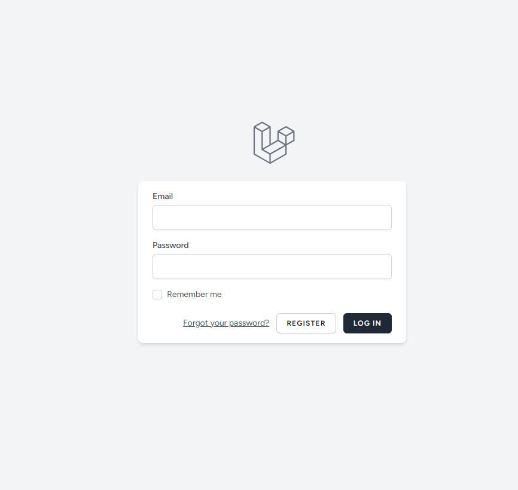
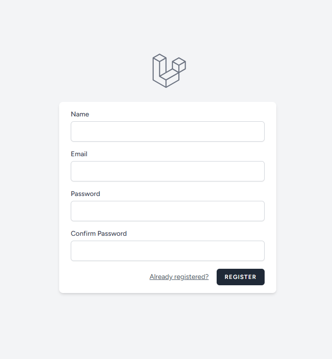
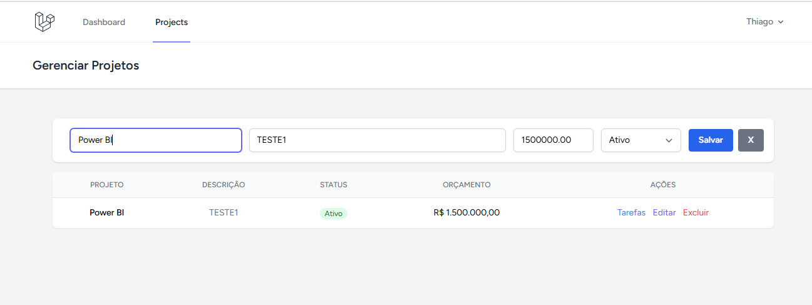
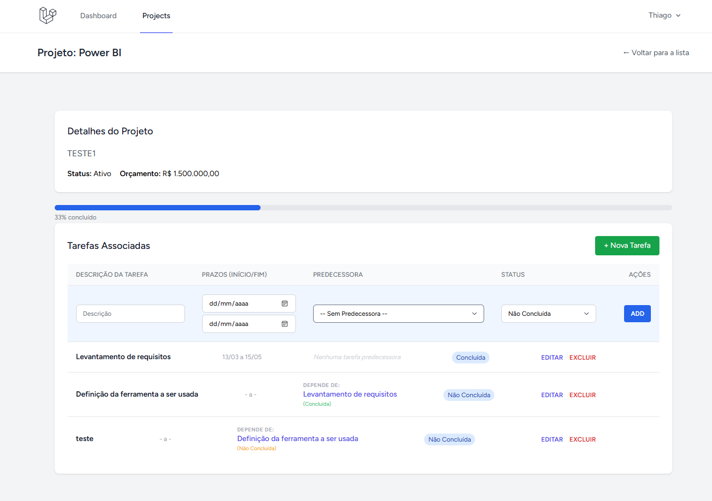

## 🌍 Mini Mundo

A aplicação consiste em um sistema para gerenciar **projetos** e **tarefas**. Foram implementadas regras de negócio para evitar a duplicidade de nomes nos projetos e duplicidade de tarefas assim como restrições de exclusão se houver precedência, permitindo operações completas de CRUD (Criar, Consultar, Editar e Excluir) sob autenticação obrigatória.

### 🛠️ Ferramentas
* **Framework:** Laravel 12 (com Breeze para autenticação)
* **Infraestrutura:** Docker & Docker Compose
* **Automação:** CI/CD via GitHub Actions

---

### 🚀 Como Executar

#### Via Pipeline (CI/CD)
Para disparar o fluxo de automação, utilize as tags de versão:
```bash
git add .
git commit -m "Finalizando configuracao de CI/CD"
git tag v1.1.0
git push origin v1.1.0

Ambiente Local (Docker)
Para subir o ambiente rapidamente fora da pipeline:

```bash
docker-compose up -d
```
📸 Demonstração do Sistema
Tela de Login



Registro de Novo Usuário



Gerenciamento de Projetos



Gerenciamento de Tarefas

